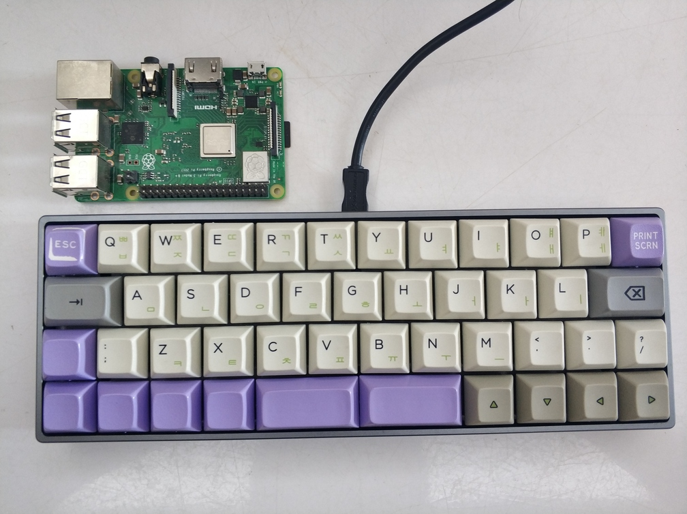
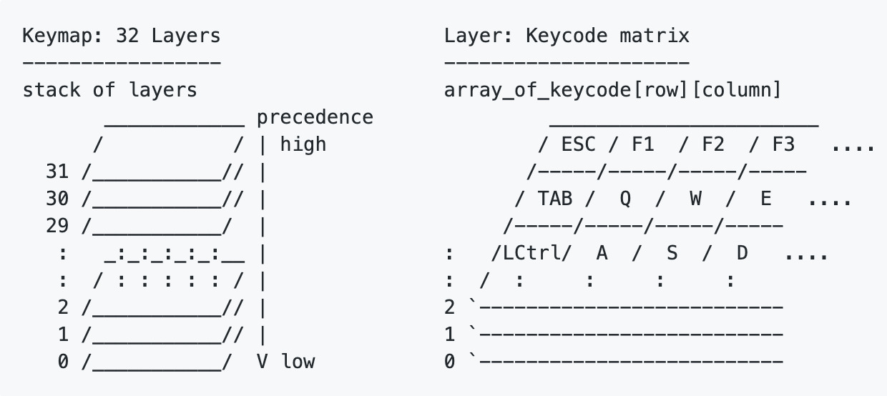
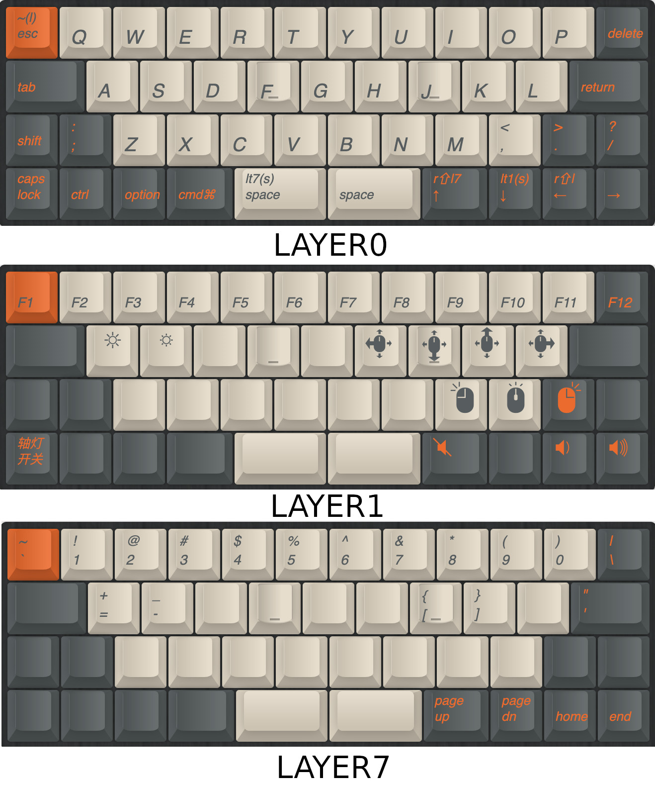

最近看到有人晒的[Planck EZ](https://ergodox-ez.com/pages/planck)，对40%键盘非常心动，不过Planck EZ的价格还是太高了，于是在咸鱼上入了一把[YDPM40](http://help.ydkb.io/doku.php?id=keyboards:ydpm40)。YDPM40是YANG设计的，分为YDP40和YDM40两种布局，前者是类似于Planck的直排，而后者更接近于一般键盘的斜排。我买的这把是YDM40，共44个键，非常适合极简主义者以及囊中羞涩（毕竟需要的轴比较少）、喜欢折腾的人。

对于40%键盘，简洁固然有了，但是也给使用者一个难题：如何保证打字体验？答案是「层」。层其实并非一个很新的概念，考虑一下我们使用的键盘，同一个字母的大小写都是由一个键来实现的，输入小写字母的时候直接按该键，输入大写字母的时候按住`Shift`再按对应的键。这其实相当于把键盘分为两层：大写字母和小写字母，其中小写字母是默认层，按住`Shift`瞬时切换到大写字母层。大部分键盘还有一个`Caps Lock`键，按一下就直接打开了大写字母层。

YDMP40基于hasu写的[TMK](https://geekhack.org/index.php?topic=41989.0)固件，该固件的初衷是给HHKB加上可编程接口（以及蓝牙支持），其中[对层的支持更加强大](https://github.com/tmk/tmk_keyboard/wiki/Keymap)，为客制化键盘提供了非常强大的工具。TMK层的示意图如下：

TMK最多支持32层，YDMP40支持8层。每一层都有一个开关状态，也有对应的优先级；对于键盘上的每个键，我们可以设置它在每一层的值：一般键值、透明或者禁用。在我们按下每个键时，首先对激活的层按照优先级从高到低进行查询，如果有键值或者是禁用，则停止；如果遇到透明值，则继续到低优先级的层查询。通过这样一种简单的机制，就可以在同一个键上叠加不同的值，然后根据切换层的开关状态来实现多种输入效果，对于小键盘而言实在是非常强大的工具。YANG提供了一个[网站](http://ydkb.io/)来进行各个层的设置，设置完之后可以载固件，用[相应的工具](http://help.ydkb.io/doku.php?id=bootloader:boothid)来刷固件。

在定义布局时，我想尽量保持布局和其他键盘一致，同时使得常用的键都能够在默认层上，所以复用了很多的键（比如单按左空格就是空格，长按或与其他键组合就是开启第7层），这是我的[键盘布局](http://mrw.so/4G1oNZ)：

我把次常用的数字键以及符号设置到了第7层，这是为了使用YDMP里面的一个「特殊功能」，也就是「单按↑为向上，长按为按住R Shift并瞬间开启第七层」，这样就可以按住上箭头直接输入数字键上面的符号了。

总体来说，对这把键盘还是比较满意的，虽然键比较少，但是通过层和键的复用，可以最大程度满足日常使用。此外，由于键盘比较小，能够使大部分的键都在手的范围内，不用大范围的移动也算一种优势。如果说缺点，把常用键都塞到默认层还是有点勉强，如果能多一列可能会好很多。
